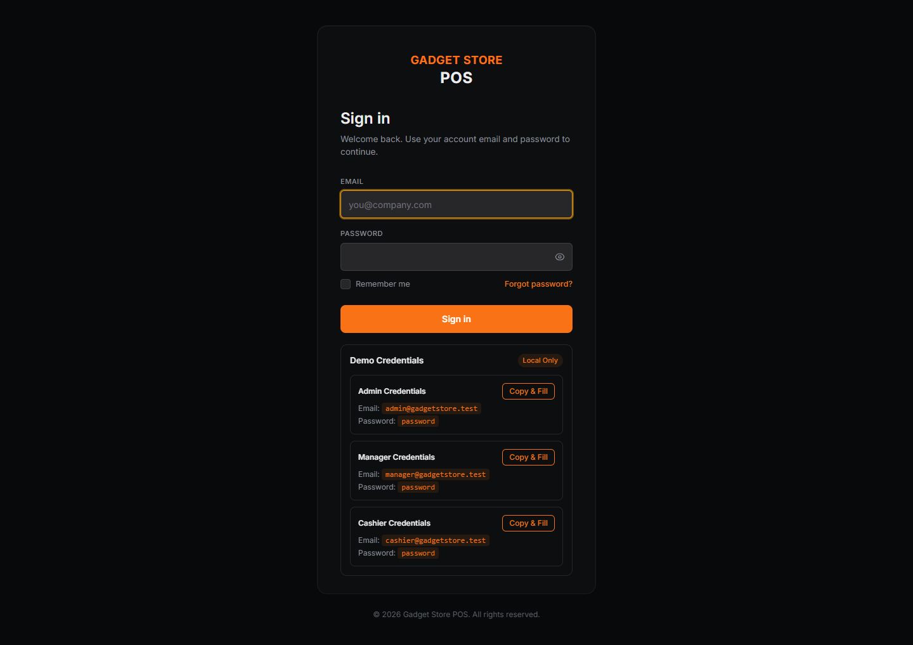
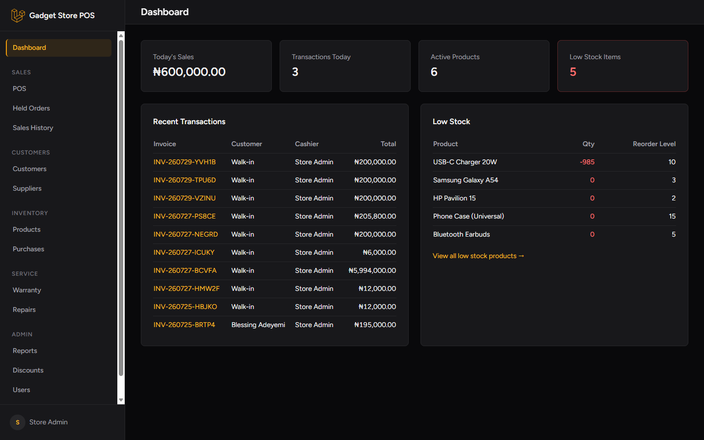
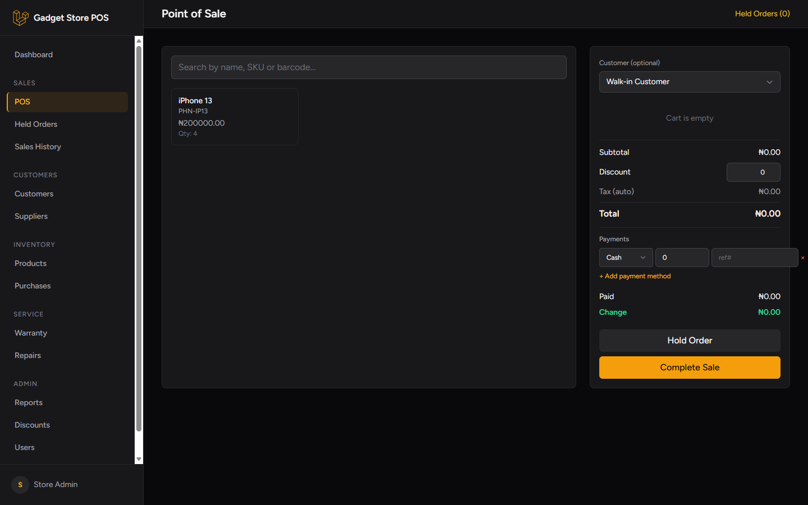
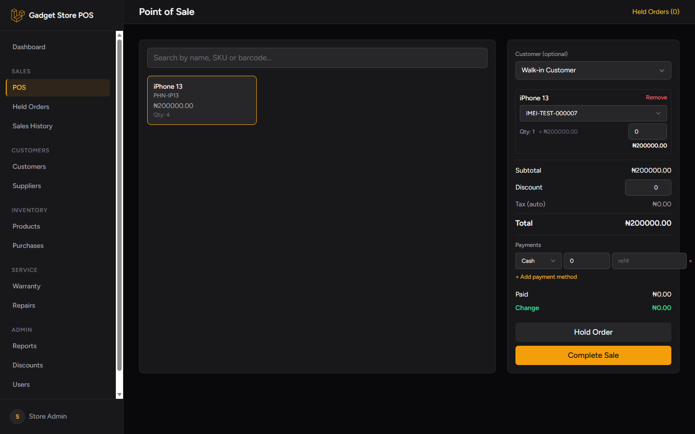
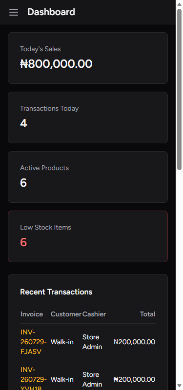
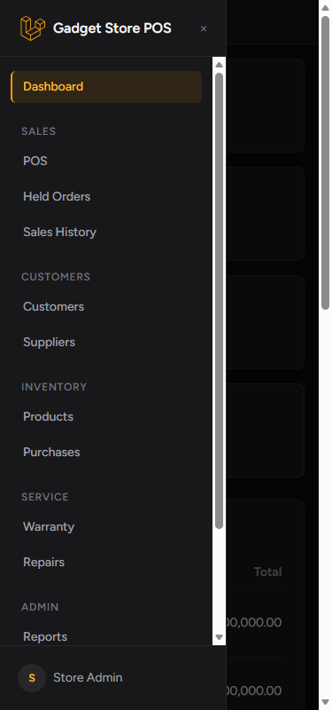

# Softpro POS

A point-of-sale system built on Laravel 12 — multi-store inventory, sales, purchasing, accounting, and reporting, with an offline-capable POS screen installable as a desktop PWA.

## Table of Contents

- [Features](#features)
- [Screenshots](#screenshots)
- [Stack](#stack)
- [Documentation](#documentation)
- [Quick Start](#quick-start)
- [Security](#security)
- [License](#license)

## Features

- **POS screen** — offline-capable, installable as a desktop PWA, barcode/SKU/IMEI search, held orders, split payments, receipt printing
- **Multi-store inventory** — products, categories, brands, units, serials, stock transfers and reconciliation
- **Sales** — sales history, returns, discounts, customer accounts, shifts and cash reconciliation
- **Purchasing** — purchase orders, purchase returns, suppliers and supplier payments
- **Warranty & repairs** — warranty tracking, repair tickets with status history
- **Accounting** — journal entries, fiscal periods, expenses and expense categories
- **Reporting** — saved/custom reports across sales, inventory and accounting
- **Roles & permissions** — via `spatie/laravel-permission`, with activity logging via `spatie/laravel-activitylog`

## Screenshots

| | |
|---|---|
|  |  |
| Sign in | Dashboard |

| | |
|---|---|
|  |  |
| Point of Sale | POS — item added to cart |

| | |
|---|---|
|  |  |
| Mobile dashboard | Mobile navigation |

## Stack

PHP 8.2+, Laravel 12, MySQL, Tailwind CSS v3, Alpine.js, `spatie/laravel-permission`, `spatie/laravel-activitylog`. Server-rendered — no separate frontend framework or API layer.

## Documentation

- **[Setup Guide](docs/SETUP.md)** — installing dependencies, configuring the database, and how the app runs as persistent Windows services (Apache + MySQL) rather than a temporary dev server.
- **[User Guide](docs/USER_GUIDE.md)** — roles, shifts, running the POS screen, receipt printer/scanner hardware notes, store branding.
- **[Architecture](docs/ARCHITECTURE.md)** — the multi-store data model, stock movement and accounting services, the tax engine, and frontend conventions, for anyone extending the codebase.

## Quick Start

```powershell
composer install
npm install
copy .env.example .env
php artisan key:generate
php artisan migrate --seed
npm run build
```

See [docs/SETUP.md](docs/SETUP.md) for full setup instructions, demo login credentials, and how the app is actually served day-to-day (not `php artisan serve`).

## Security

| | |
|---|---|
| Admin/staff access | Role-based access via `spatie/laravel-permission` |
| Audit trail | All model changes logged via `spatie/laravel-activitylog` |
| SQL injection | Eloquent ORM / query builder with parameter binding throughout |
| Mass assignment | Explicit `$fillable` on Eloquent models |
| Secrets | Database and mail credentials kept in `.env`, excluded from version control |

## License

This project is proprietary and not licensed for public use or redistribution.
